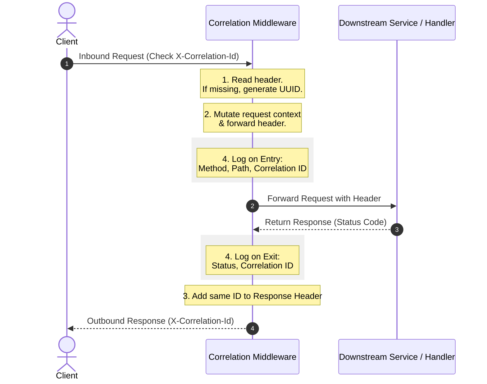

**Role of CorrelationIdFilter**

Every HTTP request that enters the gateway gets a unique X-Correlation-Id. 
That ID travels with the request across every service it touches — booking-service, flight-search-service, payment-service — and comes back in the response. 
Without it, when something fails in production you'd have logs scattered across 4 services with no common thread to link them.

# Request Lifecycle Diagram


@Component — marks a class so Spring auto-detects and registers it as a bean during component scan. Spring calls the constructor for you.

@Bean — a method-level annotation inside a @Configuration class. You write the construction logic yourself. 
Used when you need control over how the object is built — third-party classes you can't annotate, conditional wiring, or complex setup.

@Configuration — marks a class as a source of @Bean definitions. 
It's a specialised @Component that tells Spring "this class exists to declare beans, not to be used directly itself."


```text
  application.yml          your filters              built-in
        │                       │                       │
        │  defines where        │  enrich/validate      │  makes the call
        ▼  to send it           ▼  the request          ▼
    uri: http://        CorrelationIdFilter        NettyRoutingFilter
    localhost:8082      SecurityHeadersFilter      → HTTP POST to :8082
                        StripPrefixFilter
```


